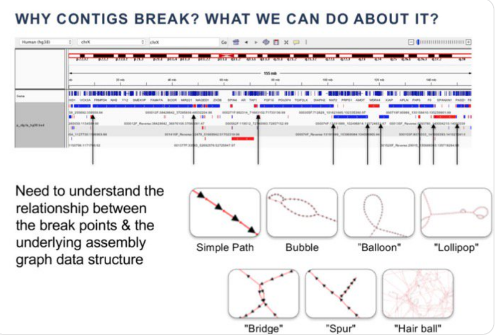

# Stamps Day 4: trimming & alignment

**(Strategies and Techniques for Analyzing Microbial Population Structure)**

 - Connecting to server: https://hackmd.io/@astrobiomike/stamps2019
 - STAMPS wiki: https://github.com/mblstamps/stamps2019/wiki

## **Trimming** (Adina Howe)

 - https://github.com/mblstamps/stamps2019/blob/master/assembly/trimming.md

 - Are they the same length? IF so they haven't been modified
 - Are adapters removed?
 
### Using trimmomatic

### **Assembly** (Adina)

 - https://github.com/mblstamps/stamps2019/blob/master/assembly/megahit.rst#run-the-megahit-assembler
 
 - BLAST:
  - how long? if super short
  - percent identity, how many others does it match
  - evalue (distribution of everything, then assign a cutoff, not just 1e-5)
  - how many other matches? 
  
### **Alignment** (Titus)

2 MB - 10 MB is generally range of size for bacterial/archaea genome sizes

 1. reads from metagenome from sequencing (error prone, 250bp Illumina, 0.01-0.02% error)
 2. magic
 3. contigs - which are longer genome fragments
    - chimeric contigs very rare in bacteria/archea, get them from prophage inserts, etc
    - **contig**: provide more signal, less data, fewer errors
    
Assess contigs with tools like BANDAGE

### Have **contigs**

 - gene annotations: look at curated subset of genes, prokkla >> gene names, amino acid seqs >> functional (KEGG)
 - targeted gene finding: BLAST or HAMMER (gene search tools, used in targeted way against your contigs)
 - counting conigs
 - binning into genomes
 - taxonomy
 - microvariation at operon structures
 
### Tools

 - https://tylerbarnum.com/2018/02/26/how-to-use-assembly-graphs-with-metagenomic-datasets/
 - https://tylerbarnum.com/2018/02/26/how-to-use-assembly-graphs-with-metagenomic-datasets/
 - [Bandage for visualizing assembly graphs](https://rrwick.github.io/Bandage/)
 - [Assembling a metagenome and recovering “genomes” with anvi’o](https://astrobiomike.github.io/genomics/metagen_anvio)
 
 
 
 
 
 
 
 
 
 
 
### Phylogeny & Trees (Tandy)
 
Taxonomy is static

 - Phylogeny can change, use data to look/modify, usually unrooted. 
 - if phylogeny is rooted, it has an outgroup.
 - branch length reflects the amount of **CHANGE** not **TIME**
 - from sequences you can infer a tree 
 
 Abundance profiling, 10% may help you classify better than doing a poor job with *all* the data.
 
 **TIPP (Bioinformatics 2014)** Does well and is robust for abundance profiling with long/short segments, and high indel rates.
 - Hellinger Distance (measure of error, scaled 0-1 (1 meaning high error) vs. indel
 - application of the eHMM method for taxonmic iID and b)metagenomic abundance classification
 
 **kmers** don't deal with indels
 
### RAxML: heuristic for large-scale ML optimization

 - with less evolution, you can get better tree with same alignment error. 
 - alignment error reflects high evolutionary heterogeneity in you data
 - increasing rate of evolution means more error
 - SEPP works a bit better than HMMR.
 
## **Field to Figure** (Adina Howe)

*adina.howe@gmail.com* *(www.germslab.org)*

Cost of samples: variable depending on level of detail/primers, etc

 - plating $3
 - qPCR $4/sample
 - 16s $15/sample
 - meta-ome $1k-5k/sample
 - nutrients in situ $15-25
 
### Primer Prep:
 
 - Designing probes for specific genes: e.g., ammonia oxidation genes for nitrogen cycling in the soil (Liu and Villenueva et al. in prep). Number of clusters found by similarity threshold.

 - High throughout QPCR, liquid handling and micro fluidics (Biomark HD):
    - quantifications for 192x samples x up to 24 targets (4,608 reactions)
   
 - 